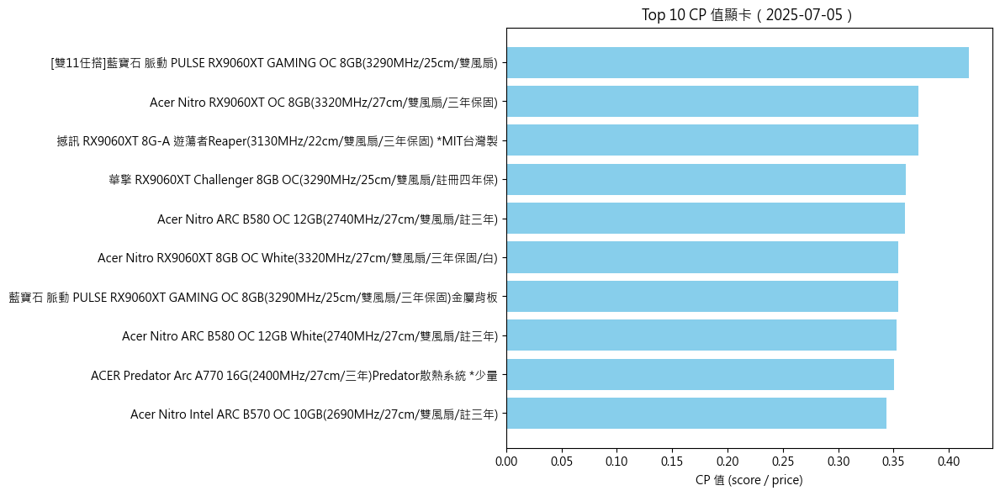
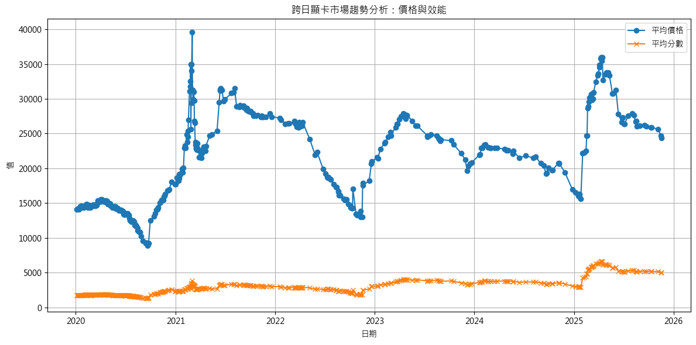
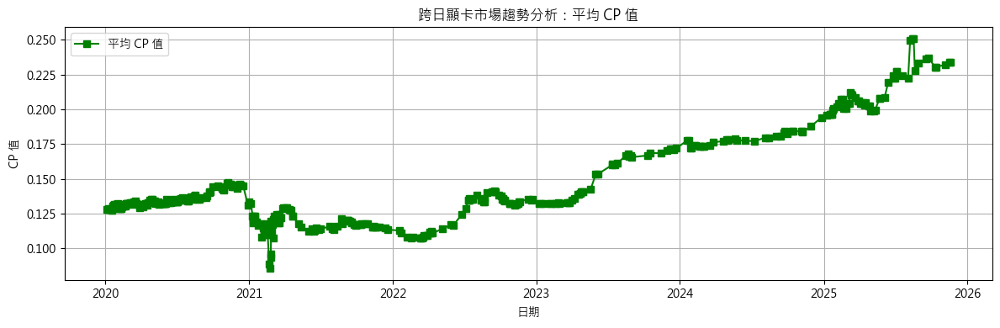
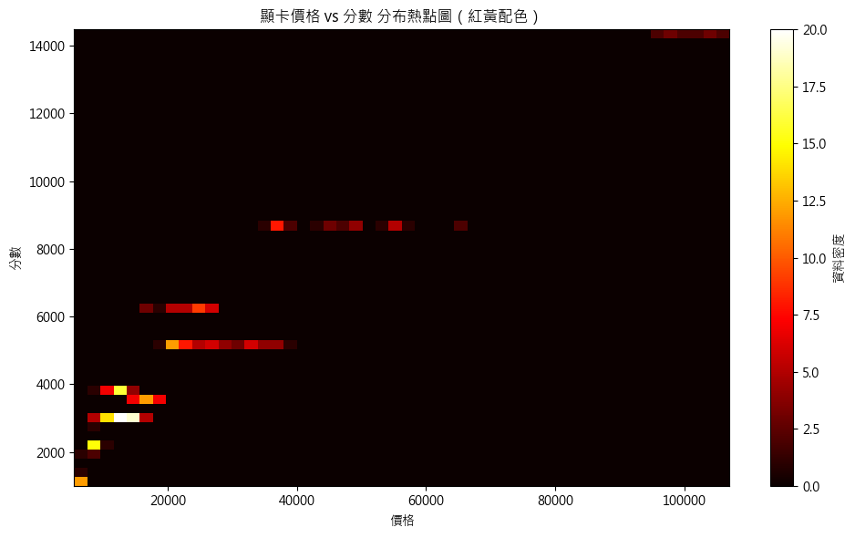
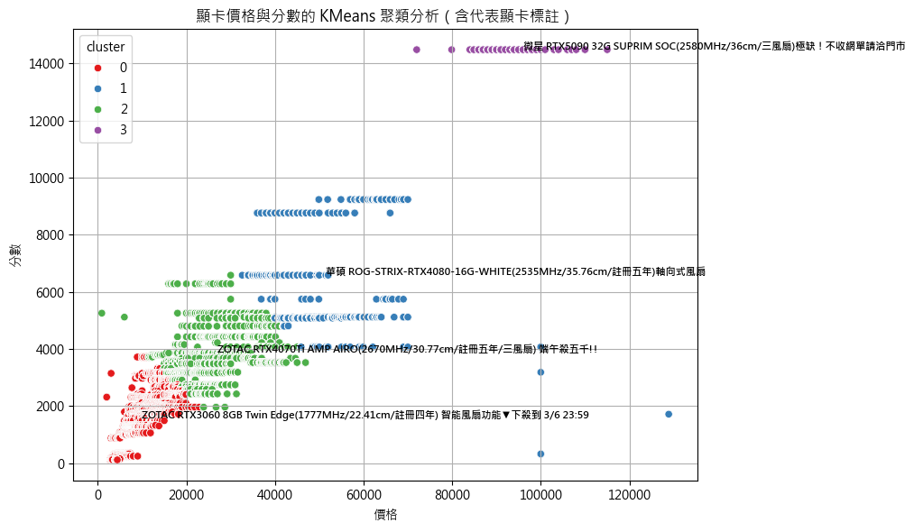

## **Phase 5 - 數據分析報告**

題目主題：結構型資料的分析案例
專案脈絡：詳見"分析文件撰寫.docx"
主要技術或工具：Python、selenium、sqlite、pandas、sklearn、matplotlib、seaborn

### 📘 一、引言

本次專案以原價屋顯示卡銷售資料為基礎，分析其價格、效能（分數）、以及性價比（CP 值）等指標，探索市場趨勢與產品定位。分析目標包括：

- 探索價格與效能的關聯性
- 發現高性價比顯卡
- 藉由視覺化與描述統計洞察市場動態
- 是否推薦現在購買顯示卡

---

### 🧹 二、數據清理

在 Phase 3，我們完成以下清理流程：

- 移除無效分類（如轉接盒、周邊配件等非顯卡產品）
- 建立 `pure_chipset` 欄位，將原始產品型號標準化
- 對應 GPU 跑分資料，補上每張顯卡的效能分數 `score`
- 新增 `CP` 欄位（score / price），用以衡量性價比
- 移除 `pure_chipset` 為空值的資料，保證分析資料有效

✅ 最終清理後，共保留 **68,034 筆有效顯卡紀錄**。

---

### 📊 三、探索性數據分析（EDA）

#### 1️⃣ 描述性統計分析：

| 指標  | 平均值  | 中位數  | 標準差  | 最小值 | 最大值   |
| ----- | ------- | ------- | ------- | ------ | -------- |
| 價格  | $20,243 | $14,800 | $15,933 | $2,790 | $128,888 |
| 分數  | 2,784   | 2,011   | 2,220   | 122    | 14,411   |
| CP 值 | 0.14    | 0.143   | 0.053   | 0.003  | 0.85     |

📌 **觀察摘要：**

- 價格分布極度右偏，有部分顯卡極高價
- 分數集中於 1,000 ～ 4,000，CP 值集中於 0.09 ～ 0.18

---

#### 2️⃣ 數據視覺化圖表與分析







---

#### 3️⃣ 時間序列趨勢分析

- 平均價格與平均 CP 值都有上升的趨勢，所以即便顯示卡價格變貴仍有購買的價值

---

### 🔎 四、初步發現與結論

1. 顯卡價格與效能具高度正相關，但部分產品價格明顯高於表現。
2. 高性價比產品多集中在中價區段（$8,000 ～ 15,000）。
3. Intel Arc B580、AMD 5070XT/5070 提供優異 CP 值，具有市場潛力。
4. 即便顯卡平均價格持續上升，但 CP 值也跟著持續上升，代表現在購買顯卡是可行的
5. 唯一 CP 值快速下降的時間點為 2021 年顯示卡礦災的時期
6. 可優先購買 AMD RX9070XT/RX9070、Intel ARC B570/ARC B580 顯示卡。具目前最高的 CP 值。Nvidia 陣營則有 RTX5060 具高 CP 值

---

### 🚀 五、下一步計畫

- ➕ 進行特賣時間以及比特幣幣值是否會影響顯示卡市場
- 🧠 建立推薦模型：依照預算推薦最佳 CP 值顯卡
- 📈 發展時間序列預測模型（顯卡價格趨勢預測）

---

### 六、專案流程總覽（6 檔案依序執行）

本專案的目標是：**從原價屋（Wayback）歷史頁面取得顯卡商品與價格 ➜ 從 UL Benchmarks 取得顯卡效能分數 ➜ 透過對照表把兩邊資料對齊 ➜ 計算 CP 值（Score / Price）➜ 進一步清理、分析**。以下為檔案執行順序與作用說明：

## 1) `1 wayback_vga_tracker.py`

**用途：**  
批次抓取 WebArchive（Wayback Machine）上原價屋 `evaluate.php` 的每日快照，解析「顯示卡 VGA」欄位，寫入 SQLite `vga.db`。

**重點：**

- 初始化 `vga` 資料表（欄位：`date, chipset, product, price`；以 `(date, chipset, product)` 做唯一約束避免重複）。
- 先查資料庫已有日期，爬取時直接**跳過已存在日期**，避免重覆抓取。
- Selenium（可切成 headless）開頁、定位 `顯示卡VGA` 的 `<optgroup>` 與 `<option>`，解析商品與價格後寫入 DB。

**先跑它，得到：** `vga.db`

**執行範例：**

```bash
python "1 wayback_vga_tracker.py"
```

---

## 2) `2 gpu_scraper_ul.py`

**用途：**  
從 UL Benchmarks「Best GPUs」頁面抓取**顯卡型號與分數**，寫入 SQLite `gpus.db`。

**重點：**

- 初始化 `gpus` 資料表（`id, name, score`）。
- Selenium（可切 headless）抓表格每列的 GPU 名稱與分數後寫入 DB。

**第二步執行，得到：** `gpus.db`

**執行範例：**

```bash
python "2 gpu_scraper_ul.py"
```

---

## 3) `3 gpu_mapping_checklist.json`

**用途：**  
**名稱對照表**（多對一）：把原價屋頁面的「系列／標題」字串（如：`NVIDIA RTX3060-12G`）對應到 UL 分數表裡的**標準顯卡名稱**（如：`NVIDIA GeForce RTX 3060`）。此映射表檔案由 Chatgpt 產生。

對不上或不需要的條目可為 `null`（略過）。

**不用執行，是供下一步程式讀取的設定檔。**

---

## 4) `4 mapping.py`

**用途：**  
把 `vga.db` 與 `gpus.db` 接起來，完成**對齊與計算 CP 值**。

**流程：**

1. 讀入 `gpu_mapping_checklist.json`。
2. 對 `vga` 表**新增欄位**：`pure_chipset`（對齊後的標準名稱）、`score`（效能分數）、`CP`（性價比，score/price）。
3. 以對照表把 `vga.chipset → pure_chipset` 填上正規化名稱。
4. 從 `gpus.db` 載入（`name, score`），把分數寫回 `vga.score`（以 `pure_chipset` 對應到 `name`）。
5. 計算 `CP = score / price`（僅在兩者都有效且 `price != 0` 時）。

**第三步執行，更新：** `vga.db`（新增並填好 `pure_chipset / score / CP`）

**執行範例：**

```bash
python "4 mapping.py"
```

> ✅ 到這裡為止，你已經擁有：
>
> - `vga.db`：含 date/chipset/product/price + pure_chipset/score/CP
> - `gpus.db`：含 name/score

---

## 5) `5 pre_process_data.ipynb`

**用途（資料前處理，建議在 Jupyter 內執行）：**

- 從 `vga.db` 讀取原始表。
- 進行 **清理**：例如移除 `pure_chipset` 為空、價格或分數異常的列；必要時去重、欄位正規化。
- 依你的分析需求，輸出**乾淨版資料表**（可回寫到同一 DB 的新表，如 `vga_clean`，或輸出成 `csv` 供後續 EDA）。

**第四步執行，產出：** 乾淨資料（如 `vga_clean` 表或 `csv`）

---

## 6) `6 data_analyze.ipynb`

**用途（探索性資料分析/視覺化）：**

- 以前一步的乾淨資料為基礎，做 **EDA**：分布、趨勢、品牌/系列比較。
- 產出圖表與初步結論，例如：**各卡 CP 值排名、時間序列價格趨勢、分數區間對價格帶的影響**等。
- 視需求匯出圖表或報告（如 `png`、`html`/`pdf` 報告）。

**第五步執行，產出：** 分析圖表／報告

---

## 環境需求與小提醒

- **Python 3.10+**（建議）
- **套件**：`selenium`, `requests`, `pandas`, `sqlite3`, `matplotlib`, `numpy`, `seaborn`, `sklearn`（標準庫）
  ```bash
  pip install -r requirements.txt
  ```
- **Chrome / ChromeDriver**：版本需相容；若要無頭模式，記得解除註解 `--headless`。
- **抓取間隔**：視網頁載入速度調整 `time.sleep()`；必要時可加入顯性等待（`WebDriverWait`）。

---

## 一鍵跑完（命令列示意）

```bash
# 1) 取得歷史價格資料
python "1 wayback_vga_tracker.py"

# 2) 取得效能分數
python "2 gpu_scraper_ul.py"

# 3) 對齊 + 計算 CP 值
python "4 mapping.py"

# 4) Jupyter 進行前處理與分析
# (在 notebook 裡開啟並依指示逐步執行)
# jupyter lab
# 開啟「5 pre_process_data.ipynb」→ 產出乾淨資料
# 開啟「6 data_analyze.ipynb」→ 做 EDA 與圖表
```
